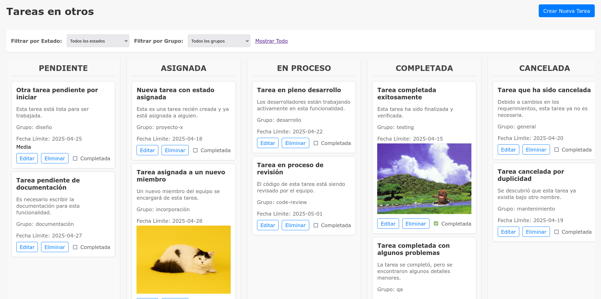
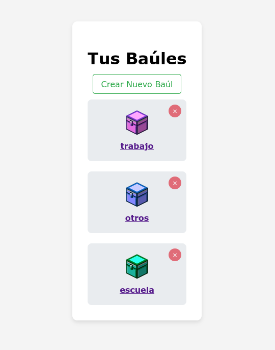

# todo-list

Esta aplicación permite gestionar tareas a través de una interfaz de consola, una API web con FastAPI y una interfaz web con Flask.
Las tareas se organizan en diferentes "baúles" (archivos JSON) almacenados en la carpeta `data/baules/`.

## Estructura del proyecto
* `modelos/tarea.py`: Define la estructura de la clase `Tarea`.
* `servicios/gestion_tareas.py`: Contiene la lógica para gestionar las tareas (CRUD, filtrar, eliminar baúl, etc.).
* `api/main.py`: Define la aplicación FastAPI y sus endpoints para la gestión de tareas a través de una API web.
* `web_ui/`: Contiene los archivos de la interfaz web desarrollada con Flask.
    * `web_ui/app.py`: La aplicación Flask principal.
    * `web_ui/templates/`: Contiene las plantillas HTML para la interfaz web.
    * `web_ui/static/`: Contiene archivos estáticos como CSS e imágenes.
* `data/baules/`: Almacena los archivos JSON de los diferentes baúles de tareas.
* `main_bk.py`: Proporciona una interfaz de línea de comandos para la gestión de tareas.

## Cómo ejecutar la aplicación

### Entorno Virtual 

1.  **Navega al directorio raíz del proyecto (`todo-list`) en tu terminal.**
2.  **Crea un entorno virtual:**

    ```bash
    python3 -m venv venv
    ```

3.  **Activa el entorno virtual:**

    ```bash
    source venv/bin/activate
    ```

4.  **Instala las dependencias necesarias:**

    ```bash
    pip install fastapi uvicorn Flask
    ```

### Interfaz de Consola

    **Ejecuta el script principal:**

    ```bash
    python3 main_bk.py
    ```

### API Web (FastAPI)

1.  **Asegúrate de tener el entorno virtual activado.**
2.  **Navega al directorio raíz del proyecto (`todo-list`).**
3.  **Ejecuta el servidor FastAPI con el siguiente comando:**

    ```bash
    uvicorn api.main:app --reload
    ```

    La API estará disponible en `http://127.0.0.1:8000`. Los baúles se gestionan leyendo y escribiendo directamente en los archivos JSON dentro de la carpeta `data/baules/`.

### Interfaz Web (Flask)

1.  **Asegúrate de tener el entorno virtual activado.**
2.  **Navega al directorio `web_ui` dentro del directorio raíz del proyecto (`todo-list/web_ui`).**
3.  **Ejecuta la aplicación Flask:**

    ```bash
    flask --app web_ui/app.py run --debug
    ```

    La interfaz web estará disponible en `http://127.0.0.1:5000` (por defecto). Esta interfaz permite crear, listar, editar, eliminar y marcar como completadas las tareas, así como crear y eliminar baúles.
    
    <div align="center">
	  <table>
		<tr>
		  <td>
			
		  </td>
		  <td>
			
		  </td>
		</tr>
	  </table>
	</div>
	

## Endpoints de la API

**Base URL:** `http://127.0.0.1:8000`

1.  **Crear una nueva tarea:**
    * **Endpoint:** `POST /baules/{nombre_baul}/tareas/`
    * **Método:** `POST`
    * **Parámetro en la URL:** `nombre_baul` (nombre del archivo JSON sin la extensión).
    * **Cuerpo (JSON):** Detalles de la tarea (`titulo`, `descripcion`, `fecha_limite`, `grupo`, `estado` (opcional, por defecto "pendiente"), `medio` (opcional)).

2.  **Listar todas las tareas de un baúl:**
    * **Endpoint:** `GET /baules/{nombre_baul}/tareas/`
    * **Método:** `GET`
    * **Parámetro en la URL:** `nombre_baul`.

3.  **Obtener una tarea específica por ID:**
    * **Endpoint:** `GET /baules/{nombre_baul}/tareas/{id_tarea}`
    * **Método:** `GET`
    * **Parámetros en la URL:** `nombre_baul`, `id_tarea`.

4.  **Actualizar una tarea existente:**
    * **Endpoint:** `PUT /baules/{nombre_baul}/tareas/{id_tarea}`
    * **Método:** `PUT`
    * **Parámetros en la URL:** `nombre_baul`, `id_tarea`.
    * **Cuerpo (JSON):** Campos a actualizar (`titulo`, `descripcion`, `fecha_limite`, `grupo`, `estado`, `medio`).

5.  **Marcar una tarea como completada:**
    * **Endpoint:** `PUT /baules/{nombre_baul}/tareas/{id_tarea}/completar`
    * **Método:** `PUT`
    * **Parámetros en la URL:** `nombre_baul`, `id_tarea`.

6.  **Eliminar una tarea:**
    * **Endpoint:** `DELETE /baules/{nombre_baul}/tareas/{id_tarea}`
    * **Método:** `DELETE`
    * **Parámetros en la URL:** `nombre_baul`, `id_tarea`.

7.  **Eliminar un baúl completo:**
    * **Endpoint:** `DELETE /baules/{nombre_baul}`
    * **Método:** `DELETE`
    * **Parámetro en la URL:** `nombre_baul` (nombre del archivo JSON sin la extensión).

## Cómo interactuar con la API

Uso `curl` para interactuar con la API. Reemplaza `mibául` y `un-id-de-tarea` con los valores correspondientes.
Adiccionalmente dejo algunos ejemplos

* **Listar tareas del baúl "trabajo":**
    ```bash
    curl [http://127.0.0.1:8000/baules/trabajo/tareas/](http://127.0.0.1:8000/baules/trabajo/tareas/)
    ```

* **Crear una nueva tarea en el baúl "personal":**
    ```bash
    curl -X POST -H "Content-Type: application/json" -d '{"titulo": "Comprar leche", "descripcion": "Ir al supermercado", "fecha_limite": "2025-04-15", "grupo": "hogar", "estado": "pendiente"}' [http://127.0.0.1:8000/baules/personal/tareas/](http://127.0.0.1:8000/baules/personal/tareas/)
    ```

* **Obtener la tarea con ID "5f8873a9-f911-420f-ad32-6e9aaf270944" del baúl "trabajo":**
    ```bash
    curl [http://127.0.0.1:8000/baules/trabajo/tareas/5f8873a9-f911-420f-ad32-6e9aaf270944](http://127.0.0.1:8000/baules/trabajo/tareas/5f8873a9-f911-420f-ad32-6e9aaf270944)
    ```

* **Actualizar el estado de la tarea con ID "5f8873a9-f911-420f-ad32-6e9aaf270944" del baúl "trabajo" a "en proceso":**
    ```bash
    curl -X PUT -H "Content-Type: application/json" -d '{"estado": "en proceso"}' [http://127.0.0.1:8000/baules/trabajo/tareas/5f8873a9-f911-420f-ad32-6e9aaf270944](http://127.0.0.1:8000/baules/trabajo/tareas/5f8873a9-f911-420f-ad32-6e9aaf270944)
    ```

* **Marcar como completada la tarea con ID "5f8873a9-f911-420f-ad32-6e9aaf270944" del baúl "trabajo":**
    ```bash
    curl -X PUT [http://127.0.0.1:8000/baules/trabajo/tareas/5f8873a9-f911-420f-ad32-6e9aaf270944/completar](http://127.0.0.1:8000/baules/trabajo/tareas/5f8873a9-f911-420f-ad32-6e9aaf270944/completar)
    ```

* **Eliminar la tarea con ID "5f8873a9-f911-420f-ad32-6e9aaf270944" del baúl "trabajo":**
    ```bash
    curl -X DELETE [http://127.0.0.1:8000/baules/trabajo/tareas/5f8873a9-f911-420f-ad32-6e9aaf270944](http://127.0.0.1:8000/baules/trabajo/tareas/5f8873a9-f911-420f-ad32-6e9aaf270944)
    ```

* **Eliminar el baúl "pruebas" (archivo `pruebas.json` en `data/baules/`):**
    ```bash
    curl -X DELETE [http://127.0.0.1:8000/baules/pruebas](http://127.0.0.1:8000/baules/pruebas)
    ```
